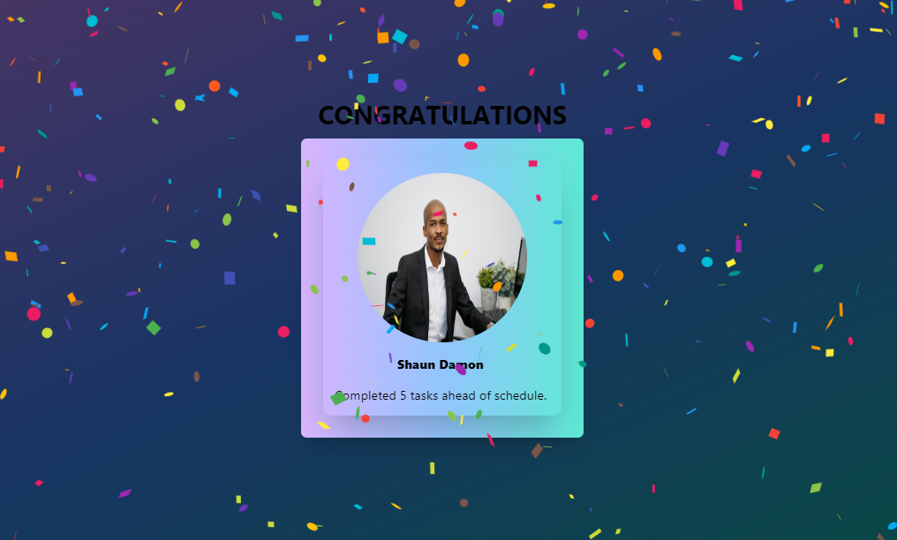

**Project Name**

RecognizeMe - Member of the Week!

**Description**

A simple React app that mimicks a celebration for a Member in our team that has been recognized for the week's effort and work.

**Features**

* Confetti animation
* Team member reveal
* Animated text
* Drumroll and applause audio effects

**Additional Information**

The `MemberCard` component uses a technique called **staggered animation** to animate the team member's information. Staggered animation is a type of animation where each element in a list is animated one at a time, with a delay between each animation. This can create a more interesting and engaging animation than simply animating all of the elements at once.

To implement staggered animation in the `MemberCard` component, we use the `useEffect` hook to create a list of timers. Each timer is set to call the `setShowElements` state function to show one of the team member's elements after a certain delay.

We also use a function called `animateWords` to split the team member's name and accomplishments into individual words and animate each word separately. This creates a more dynamic and eye-catching animation.

**Getting Started**

To get started, clone the repository and install the dependencies:

```
git clone https://github.com/your-username/surprise-me.git
cd surprise-me
npm install
```

Start the development server:

```
npm start
```

Open your browser and navigate to `http://localhost:3000`.

**Usage**

Click the **Reveal Member of The Week** button to generate a confetti explosion and reveal a team member's that is being recognized.

**Customization**

You can customize the app by editing the `components/MemberCard.js` file. This file contains the code for displaying the team member's information.

You can also change the colors of the confetti and the animated text by editing the `styles.css` file.

**Deployment**

To deploy the app to production, you can use a service such as Vercel or Netlify.

**License**

This project is licensed under the MIT license.

**Contributions**

Welcome! Feel free to contribute to this project by submitting bug reports, feature requests, or pull requests.

